# Intrinsic Image Transfer

This repository is a (Matlab) implementation of the IEEE Transactions on Pattern Analysis and Machine Intelligence (T-PAMI) paper:

[**Intrinsic Image Transfer for Illumination Manipulation**](https://ieeexplore.ieee.org/document/9961945).

[Junqing Huang], 
[Michael Ruzhansky,
[Qianying Zhang],
[Haihui Wang],

Junqing.Huang@UGent.be,
Michael.Ruzhansky@UGent.be,
zhang\_qy@sz.jnu.edu.cn,
whhmath@buaa.edu.cn

[**Abstract:**]

This paper presents a novel intrinsic image transfer (IIT) algorithm for image illumination manipulation, which creates a local image translation between two illumination surfaces. We also demonstrate its versatility and benefits to several illumination-related tasks: illumination compensation, image enhancement and tone mapping, and high dynamic range (HDR) image compression, and show their high-quality results on natural image datasets.

## Examples

1. Image tone mapping

    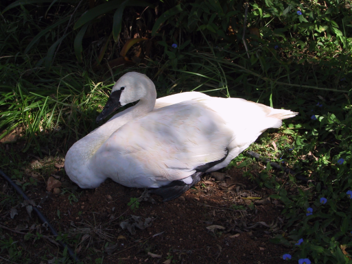
    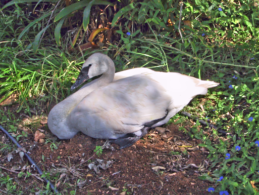
    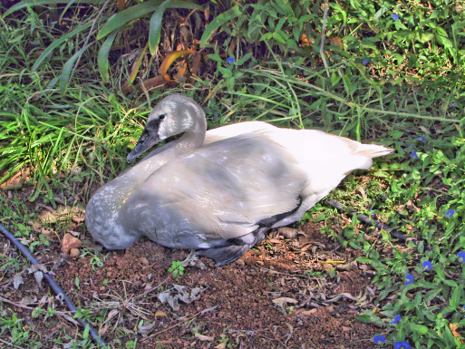

<pre>
              (a) Input                       (b) Ours                   (c) Exemplar
</pre>

2. Photorealistic style transfer

  
  
  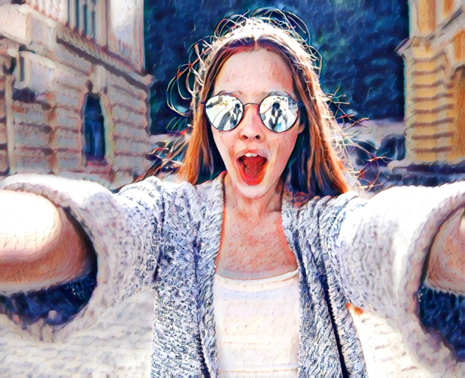
  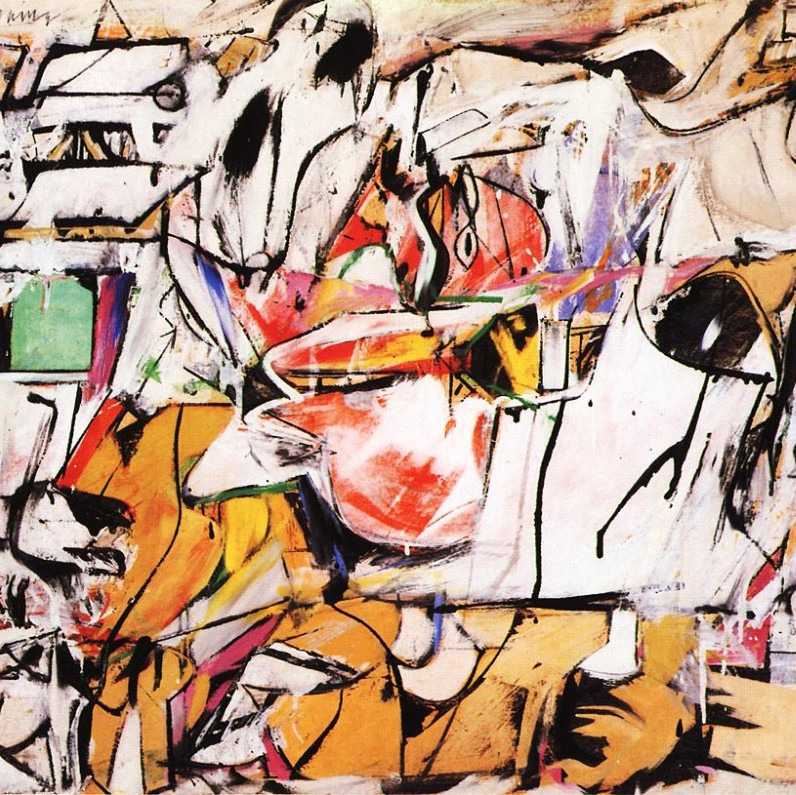

  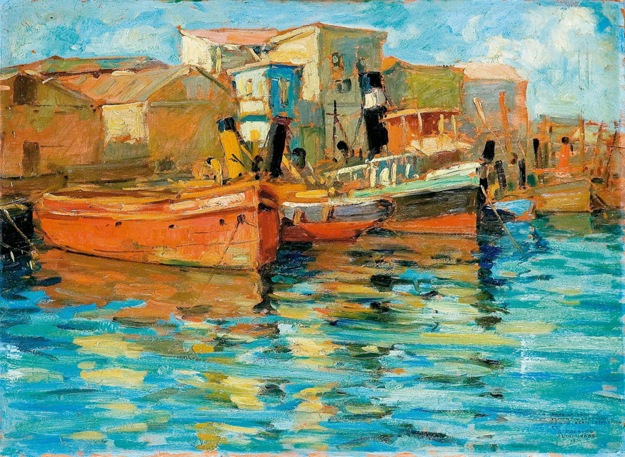
  
  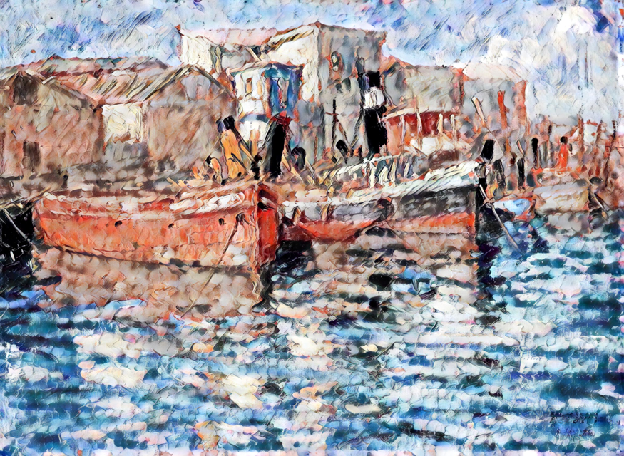
  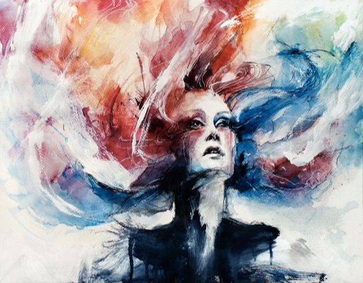

  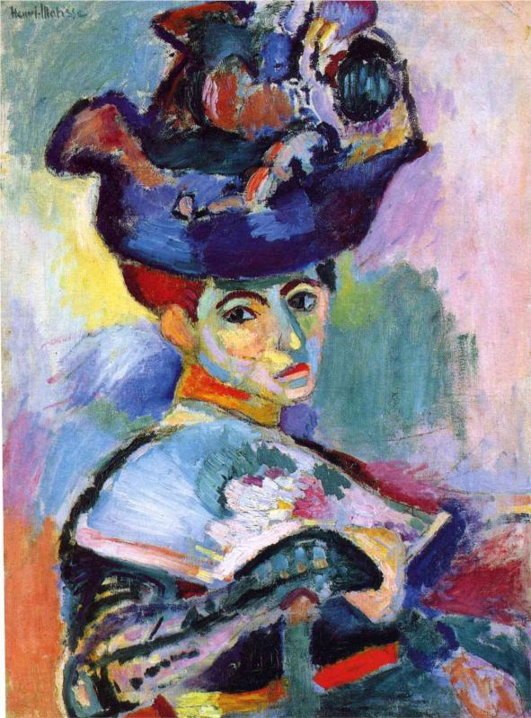
  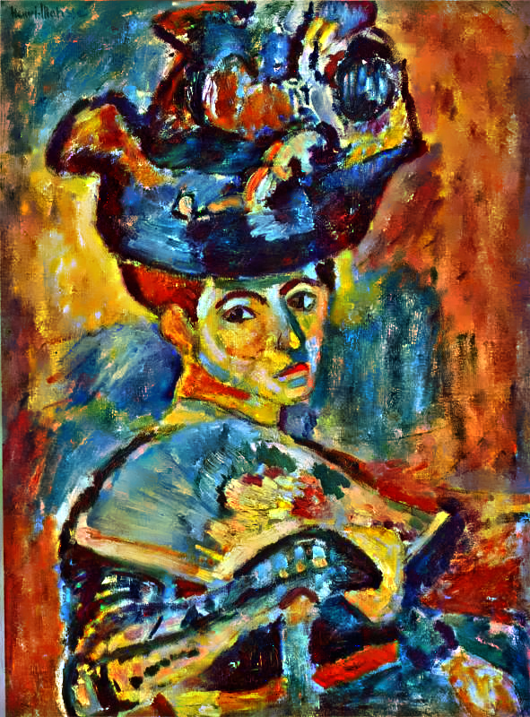
  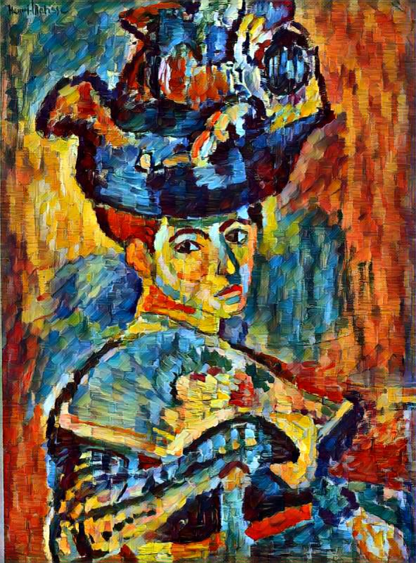
  

<pre>
              (a) Input                  (b) Ours                  (c) Exemplar         (d) Reference style
</pre>

If you have any questions or suggestions about the paper, feel free to reach me (Junqing.Huang@UGent.be).

More details will be uploaded later!
